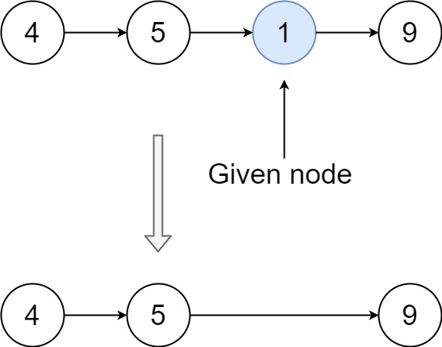

# 删除链表中的节点

## 题目
请编写一个函数，用于 删除单链表中某个特定节点 。在设计函数时需要注意，你无法访问链表的头节点head ，只能直接访问 要被删除的节点 。<br>
题目数据保证需要删除的节点 不是末尾节点 。


#### 示例 1：
<div align="center">


</div>

```
输入：head = [4,5,1,9], node = 5
输出：[4,1,9]
解释：指定链表中值为 5 的第二个节点，那么在调用了你的函数之后，该链表应变为 4 -> 1 -> 9
```

#### 示例 2：
<div align="center">



</div>

```
输入：head = [4,5,1,9], node = 1
输出：[4,5,9]
解释：指定链表中值为 1 的第三个节点，那么在调用了你的函数之后，该链表应变为 4 -> 5 -> 9
```

#### 示例 3：
```
输入：head = [1,2,3,4], node = 3
输出：[1,2,4]
```

#### 示例 4：
```
输入：head = [0,1], node = 0
输出：[1]
```

#### 示例 5：
```
输入：head = [-3,5,-99], node = -3
输出：[5,-99]
```


::: tip 提示：
链表中节点的数目范围是 [2, 1000]
-1000 <= Node.val <= 1000
链表中每个节点的值都是唯一的
需要删除的节点 node 是 链表中的一个有效节点 ，且 不是末尾节点
:::


## 题解
::: tip 解题思路
这个题目看起来有点费解，示例中提供了 `head` 以及 `node` ，但是方法中只传入了node。于是我将入参打印出来看了下：

原来是个链式的对象。<br>
结合输出中的内容，以及输出的预期结果，得知这道题目真正的目的是删除给定node的第一个节点，如此就简单多了。<br>
**主要思路就是用后一个节点覆盖第一个节点即可。**
:::

```ts

/**
 * Definition for singly-linked list.
 * function ListNode(val) {
 *     this.val = val;
 *     this.next = null;
 * }
 */
/**
 * @param {ListNode} node
 * @return {void} Do not return anything, modify node in-place instead.
 */
interface Node {
  val: number
  next: Node
}

export default function(node: Node): void {
  node.val = node.next.val
  node.next = node.next.next
}
```
