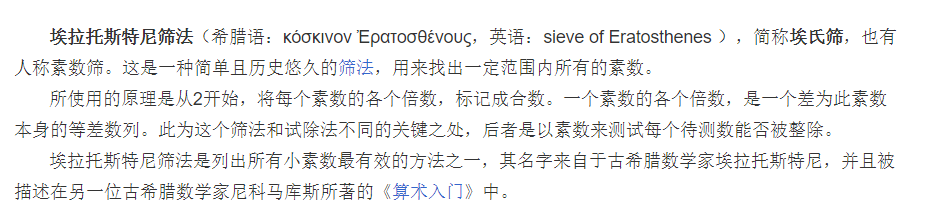

# 计数质数

## 题目
统计所有小于非负整数 `n` 的质数的数量。

#### 示例 1：
```
输入：n = 10
输出：4
解释：小于 10 的质数一共有 4 个, 它们是 2, 3, 5, 7 。
```

#### 示例 2：
```
输入：n = 0
输出：0
```

#### 示例 3：
```
输入：n = 1
输出：0
```

::: tip 提示：
0 <= n <= 5 * 10 ^ 6
:::

## 题解
::: tip 解题思路

:::

```ts
/**
 * @param {number} n
 * @return {number}
 */
export default function(n: number): number {
  const list = new Array(n).fill(true)
  let count = 0
  for (let i = 2; i < n; i++) {
    if (list[i]) {
      count++
      for(let j = 2 * i; j < n; j+=i) {
        list[j] = false
      }
    }
  }
  return count
}
```
