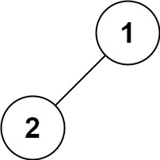
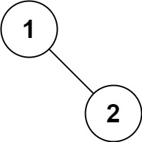

# 二叉树的前序遍历

## 题目
给你二叉树的根节点 root ，返回它节点值的 `前序` 遍历。

#### 示例 1：

```
输入：root = [1,null,2,3]
输出：[1,2,3]
```

#### 示例 2：
```
输入：root = []
输出：[]
```

#### 示例 3：
```
输入：root = [1]
输出：[1]
```

#### 示例 4：

```
输入：root = [1,2]
输出：[1,2]
```

#### 示例 5：

```
输入：root = [1,null,2]
输出：[1,2]
```

::: tip 提示：
- 树中节点数目在范围 `[0, 100]` 内
- -100 <= Node.val <= 100
:::

::: warning 进阶： 
递归算法很简单，你可以通过迭代算法完成吗？
:::

## 解法一
::: tip 解题思路
利用 `递归` 的思路。如注释所注。
:::

```ts
interface TreeNode {
  val: never
  left: TreeNode
  right: TreeNode
}

/**
 * @param {TreeNode} root
 * @return {number[]}
 */
export const preorderTraversal = function(root: TreeNode): number[] {
  const getRes = (_root?: TreeNode, res = []) => {
    // 如果存在根节点，继续向下查找，否则直接返回
    if (_root && Object.keys(_root).length) {
      // 将根节点插入数组
      res.push(_root.val)
      // 如果存在左子节点，继续遍历
      if (_root.left) {
        getRes(_root.left, res)
      }
      // 如果存在右子节点，继续遍历
      if (_root.right) {
        getRes(_root.right, res)
      }
    }
    return res
  }

  return getRes(root)
}
```

## 解法二
::: tip 解题思路
利用 `迭代` 的思路。如注释所注。
:::

```ts
interface TreeNode {
  val: never
  left: TreeNode
  right: TreeNode
}

/**
 * @param {TreeNode} root
 * @return {number[]}
 */
export const preorderTraversal = function(root: TreeNode): number[] {
  const getRes = (_root?: TreeNode, res = []) => {
    // 定义栈
    const stack: TreeNode[] = []
    // 如果节点存在，继续，否则返回
    if (_root && Object.keys(_root).length) {
      // 将根结点的值保存
      res.push(_root.val)
      // 将右树压栈
      if (_root.right) stack.push(_root.right)
      // 将左树压栈
      if (_root.left) stack.push(_root.left)
      // 如果栈内有值，取出递归
      while(stack.length) {
        getRes(stack.pop(), res)
      }
    }
    return res
  }
  return getRes(root)
}
```
