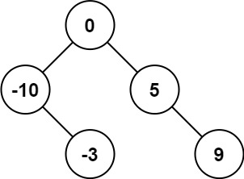

# 将有序数组转换为二叉搜索树
## 题目
给你一个整数数组 nums ，其中元素已经按 升序 排列，请你将其转换为一棵 高度平衡 二叉搜索树。<br>
高度平衡 二叉树是一棵满足「每个节点的左右两个子树的高度差的绝对值不超过 1 」的二叉树。

#### 示例 1：

> 输入：nums = [-10,-3,0,5,9] <br>
> 输出：[0,-3,9,-10,null,5] <br>
> 解释：[0,-10,5,null,-3,null,9] 也将被视为正确答案：<br>
> 

#### 示例 2：

```
输入：nums = [1,3]
输出：[3,1]
解释：[1,3] 和 [3,1] 都是高度平衡二叉搜索树。
```

::: tip 提示：
1 <= nums.length <= 10 ^ 4
-10 ^ 4 <= nums[i] <= 10 ^ 4
nums 按 `严格递增` 顺序排列
:::

## 题解
::: tip 解题思路
利用 `递归 + 二分法` 的思想。<br>
每次取数组的中间节点为根节点，将左侧的数据挂到左树，右侧的数据挂到右树，以此类推。
:::

```ts
/**
 * Definition for a binary tree node.
 * function TreeNode(val, left, right) {
 *     this.val = (val===undefined ? 0 : val)
 *     this.left = (left===undefined ? null : left)
 *     this.right = (right===undefined ? null : right)
 * }
 */
function TreeNode(this:any, val, left?, right?) {
  this.val = (val===undefined ? 0 : val)
  this.left = (left===undefined ? null : left)
  this.right = (right===undefined ? null : right)
}

/**
 * @param {number[]} nums
 * @return {TreeNode}
 */
export const sortedArrayToBST = function(nums: number[]) {
  if (!nums.length) return null
  const mid = Math.floor(nums.length / 2)
  const root = new TreeNode(nums[mid])
  root.left = nums.length > 1 ? sortedArrayToBST(nums.slice(0, mid)) : null
  root.right = nums.length > 2 ? sortedArrayToBST(nums.slice(mid + 1)) : null
  return root
}
```
